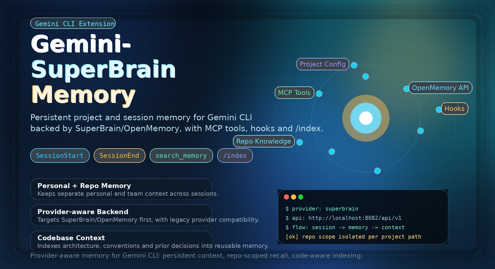

# Gemini-Supermemory



A [Gemini CLI](https://github.com/google-gemini/gemini-cli) extension that gives your AI **persistent memory across sessions** using [Supermemory](https://supermemory.ai).
Your agent remembers what you worked on — across sessions, across projects.

## Features

- **Persistent Memory** — Memories saved across sessions, automatically loaded when you start
- **Team Memory** — Project knowledge shared across your team, separate from personal memories
- **Auto Capture** — Sessions saved automatically when they end
- **Auto Load** — Past context injected when a new session starts
- **Codebase Indexing** — Deep-scan a repo's architecture and save it to memory
- **Project Config** — Per-repo settings and container tag overrides

## Installation

```bash
gemini extensions install https://github.com/Rishabjs03/gemini-supermemory
```

Set your API key when prompted (get one at [app.supermemory.ai](https://app.supermemory.ai)).

## How It Works

Your extension exposes **3 MCP tools** that Gemini calls automatically:

| Tool | Description |
| --- | --- |
| `search_memory` | Search past memories and coding sessions |
| `add_memory` | Save personal memories (decisions, preferences, learnings) |
| `save_project_memory` | Save team/project knowledge (architecture, conventions) |

Plus **two lifecycle hooks** that run behind the scenes:

| Hook | Trigger | What it does |
| --- | --- | --- |
| **SessionStart** | Session begins | Fetches your past memories and injects them as context |
| **SessionEnd** | Session ends | Saves a summary of the session to Supermemory |

## Commands

| Command | Description |
| --- | --- |
| `/index` | Index codebase architecture and patterns into Supermemory |

## Configuration

**API Key** — Set during installation, stored securely in system keychain.

To update it:
```bash
gemini extensions config gemini-supermemory
```

Or set via environment variable:
```bash
export SUPERMEMORY_API_KEY="sm_..."
```

---

**Project Config** — Create `.gemini/.supermemory/config.json` in your repo root:

```json
{
  "apiKey": "sm_...",
  "personalContainerTag": "my-personal-tag",
  "repoContainerTag": "my-team-project"
}
```

| Option | Description |
| --- | --- |
| `apiKey` | Project-specific API key |
| `personalContainerTag` | Override personal memory container |
| `repoContainerTag` | Override team memory container |

## Examples

**Search memories:**
> "What did I work on yesterday?"
> "How did we implement auth?"

**Save memories:**
> "Remember that I prefer ESM imports over CommonJS"
> "Save project knowledge: this project uses MCP for tool integration"

**Index codebase:**
> `/index`

## Architecture

```
gemini-supermemory/
├── gemini-extension.json    ← Extension manifest
├── GEMINI.md                ← Context instructions for Gemini
├── hooks/
│   └── hooks.json           ← SessionStart/End hook config
├── commands/
│   └── index.toml           ← /index codebase scanning command
└── src/
    ├── server.js             ← MCP server (3 tools)
    ├── hooks/
    │   ├── session-start.js  ← Auto-load memories
    │   └── session-end.js    ← Auto-save sessions
    └── lib/
        ├── supermemory-client.js  ← Supermemory SDK wrapper
        ├── container-tag.js       ← Container tag generation
        ├── config.js              ← Global config loader
        ├── project-config.js      ← Per-repo config loader
        ├── format-context.js      ← Memory formatting
        ├── error-helper.js        ← Error handling
        ├── git-utils.js           ← Git helpers
        └── validate.js            ← Input validation
```

## Development

```bash
# Clone and install
git clone https://github.com/Rishabjs03/gemini-supermemory.git
cd gemini-supermemory
npm install

# Link for local development
gemini extensions link .
```

## License

MIT
